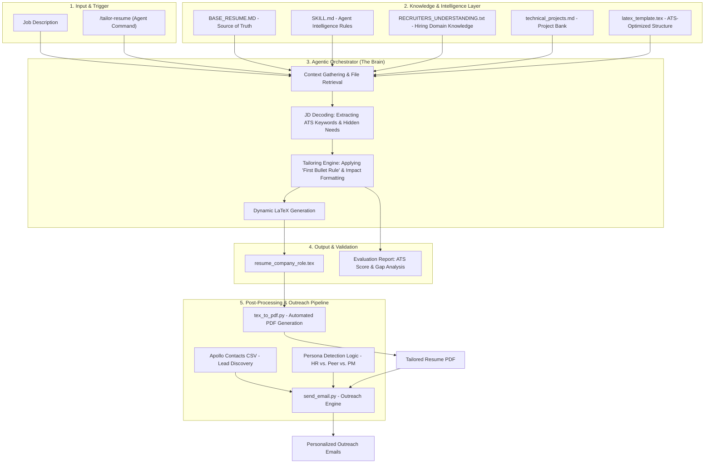

# 🤖 Agentic Job Application Automation

An end-to-end, agentic pipeline designed to automate the modern job search. This system transforms a raw Job Description into a tailored, ATS-optimized LaTeX resume and executes personalized, persona-aware outreach.

---

## 🏗️ System Architecture & Workflow

The following diagram illustrates the flow from initial Job Description (JD) input to the final automated outreach.

---

## 🌟 Key Features

### 🧠 Agentic Intelligence (`SKILL.md`)
Unlike simple template fillers, this system uses an **AI Skill Layer** that:
*   **Decodes Hidden Requirements:** Translates corporate jargon (e.g., "fast-paced") into actionable engineering signals (e.g., "minimal hand-holding").
*   **The First-Bullet Rule:** Ensures the first bullet of every role is a high-impact "Business Outcome Statement" to pass the 6-second recruiter scan.
*   **Dynamic Project Selection:** Automatically selects the most relevant projects from a repository of `technical_projects.md` based on the target role's technology stack.

### 📄 Professional LaTeX Engine
*   Generates compilable LaTeX code using the **`resume-openfont`** class.
*   Ensures 100% ATS compatibility while maintaining a high-end visual design.
*   Automated multi-pass compilation via `tex_to_pdf.py`.

### 📧 Persona-Aware Outreach
*   **Lead Ingestion:** Integrates with Apollo.io CSV exports.
*   **Persona Detection:** Automatically classifies contacts into personas (Technical Recruiter, Peer Engineer, Product Manager, HR).
*   **Contextual Messaging:** Switches email templates dynamically—using a "Peer-to-Peer" technical tone for engineers and a "High-Signal" professional tone for recruiters.

---

## 📂 Repository Structure

*   `SKILL.md`: The agent's cognitive framework and tailoring rules.
*   `BASE_RESUME.MD`: The master source of truth for all career experience.
*   `technical_projects.md`: A library of modular, XYZ-formatted project descriptions.
*   `tex_to_pdf.py`: Automation script for LaTeX to PDF conversion.
*   `send_emails.py`: Persona-driven outreach automation engine.
*   `outputs/`: Directory for all generated artifacts (Tailored Resumes, PDFs).

---

## 🚀 Getting Started

For detailed instructions on how to customize this system for your own background and run the automation pipeline, please refer to the **[USAGE_GUIDE.md](./USAGE_GUIDE.md)**.

---

## 👨‍💻 Author
**Rakesh Geddam**  
[LinkedIn](https://linkedin.com/in/rakeshge) | [Portfolio](https://github.com/rakeshgeddam)
